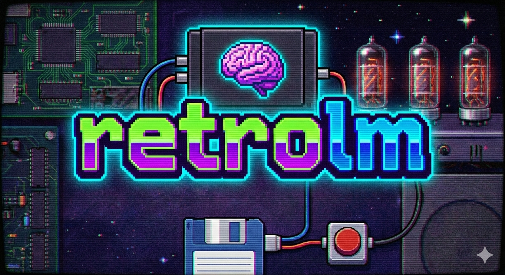

  

# 🧠 Bringing Modern AI Inference to Ancient Silicon

**retrolm** is a personal, challenging side-project: a complete Large Language Model (LLM) inference engine written from the ground up in **C and x86 Assembly**.

The core goal is to run a simple transformer model on a machine it was never meant to touch: the **Intel Pentium II** architecture, compiled using the classic **Turbo C** toolchain. This project explores the true engineering overhead of deep learning by stripping away all modern frameworks and dependencies.

## 🛠️ The Development Ethos (Hard Mode Activated)

In building this, I deliberately chose constraints to understand the fundamentals and maximize the optimization challenge:

* **Solo Development:** Every line of code was written by me alone.
* **No AI Assistance:** I relied purely on my own knowledge and classic documentation, avoiding LLMs for coding the LLM.
* **Minimalist Tooling:** Development was done primarily using a plain text editor, bypassing the comfort of modern IDE features like advanced autocompletion or dynamic debugging.
* **Classic References:** My primary guides were physical manuals: *The C Programming Language* (K&R), the *The Art of Assembly Language* (H), and archived technical forums.

## 💾 Core Technical Details

* **Zero Dependencies:** The project contains no external libraries (no PyTorch, NumPy, or specialized BLAS). I wrote all custom math and linear algebra kernels myself.
* **Authentic Toolchain:** The code is structured and compiled to be fully compatible with the Borland Turbo C / C++ environment, targeting DOS/Win9x systems.

---

# 🖥️ Required Target Hardware

To run and compile `retrolm`, you'll be aiming for the following vintage specifications. Results will vary *greatly* based on clock speed and available RAM.

| Component | Minimum Spec | Recommended Spec |
| :--- | :--- | :--- |
| **Processor** | Intel Pentium II (233MHz) | Intel Pentium II Deschutes (450MHz) |
| **RAM** | 32 MB EDO or SDRAM | 128 MB PC100 SDRAM |
| **OS** | MS-DOS 6.22 or Win95/98 | Windows 98 SE |
| **Compiler** | Turbo C/C++ 4.5+ | Borland C++ 5.02 |

---

## 🤔 Why Build This?

I wanted to find out what happens when you take one of the most resource-intensive computing concepts of today and force it onto the constraints of 1998 hardware. It's an exploration of low-level optimization, memory management, and vintage computer architecture—a challenging exercise in doing things the hard way.